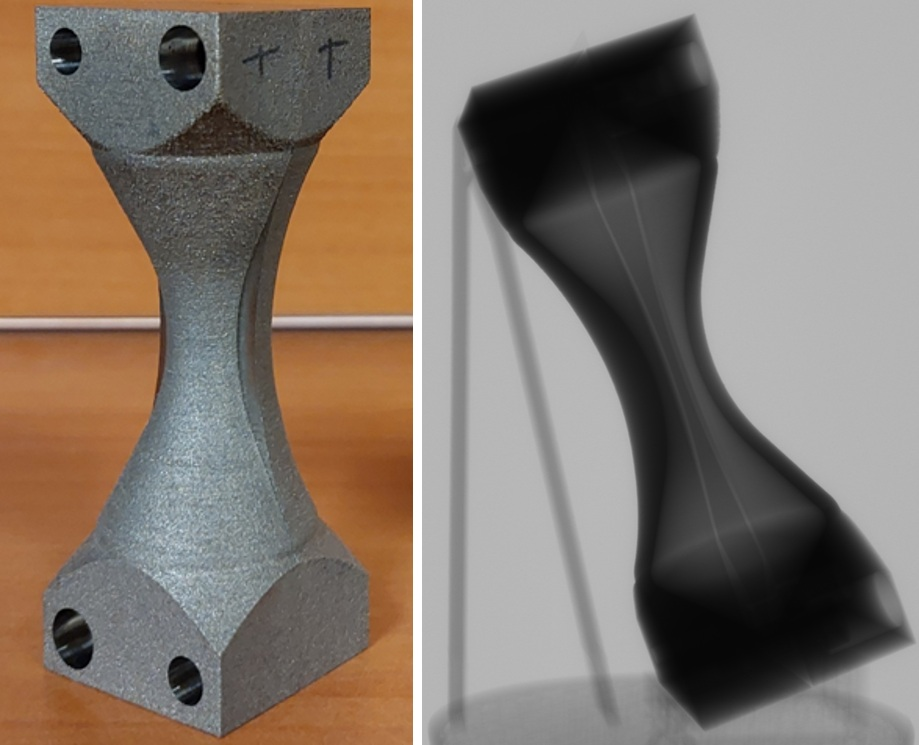
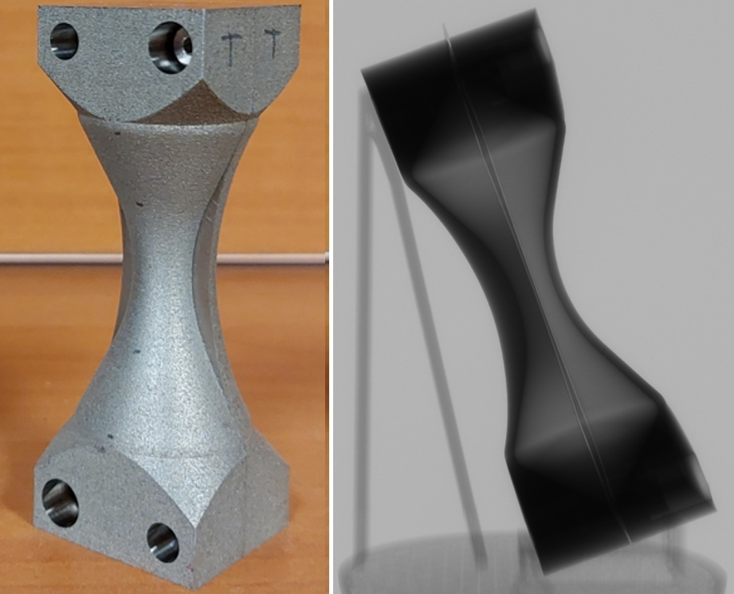
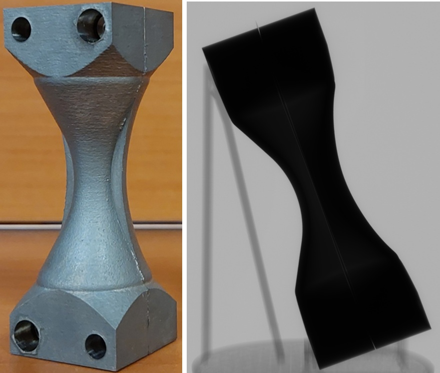
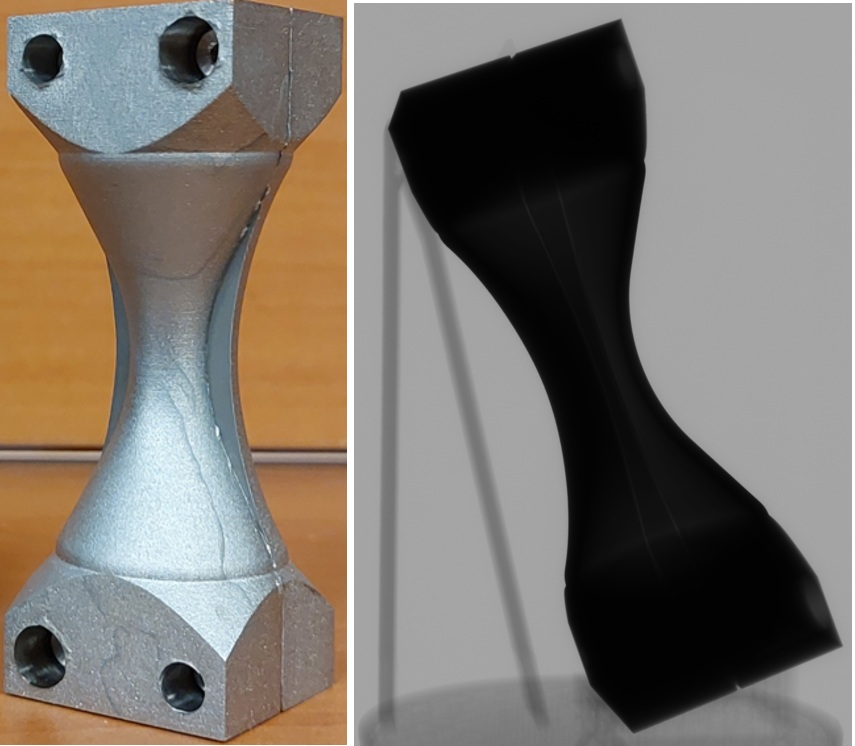
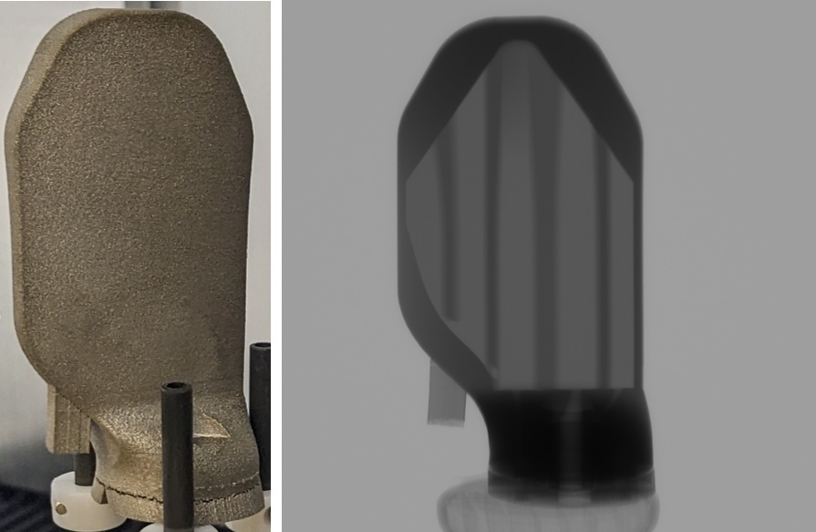

CT Metrology
--------------------

The CT-CMM benchmark data sets :cite:`valtchanov:26` contain cone-beam X-ray CT data for additively
manufactured (laser powder bed fusion) metal artefacts with internal hourglass cavities. The primary
benchmark includes Ti-6Al-4V and Inconel 625 artefacts, each measured in a rough (as-built) and a
chemically milled state. Each primary case links raw CT projections, reconstructed volumes, CT-derived
surface segmentations, nominal CAD, CMM point clouds, alignment transforms, thickness-pair vectors, and
derived surface/thickness deviation labels.

The data are intended for evaluating CT reconstruction, segmentation, surface determination, registration
and dimensional metrology workflows against a tactile coordinate measuring machine (CMM) reference for
inaccessible internal geometry. An auxiliary Chinook rotor-hub blade CT data set is included as an
additional high-attenuation reconstruction reference; it is not part of the CMM thickness benchmark.

All data were collected on a Comet Yxlon FF35 cone-beam CT system over a 360 degree scan range. The
Ti-6Al-4V and Inconel 625 artefacts were scanned with a 20 degree inclination angle, while the Chinook
blade was scanned vertically (0 degree inclination). The Ti-6Al-4V and Inconel 625 artefacts were reconstructed with CERA using a
single-material beam-hardening correction; surface-determination products were generated in Dragonfly
(Fast Surface Finding, FSF) at FSF 0.2, 0.4 and 0.6 for Ti-6Al-4V and at FSF 0.6 plus a deep-learning route
for Inconel 625. For the Chinook blade, CERA / LDA reference data and FSF 0.6 surfaces are provided where
available.

Data sets
~~~~~~~~~

+-------------+----------------+-------------+-------------------+-----------------------------------+---------+
| Tomo ID     | Case           | Material    | State             | Sample name                       | Preview |
+=============+================+=============+===================+===================================+=========+
| tomo_00110_ | Ti64-Rough     | Ti-6Al-4V   | rough LPBF        | Ti64_Rough_internal_cavity        | |00110| |
+-------------+----------------+-------------+-------------------+-----------------------------------+---------+
| tomo_00111_ | Ti64-Polished  | Ti-6Al-4V   | chemically milled | Ti64_Polished_internal_cavity     | |00111| |
+-------------+----------------+-------------+-------------------+-----------------------------------+---------+
| tomo_00112_ | IN625-Rough    | Inconel 625 | rough LPBF        | IN625_Rough_internal_cavity       | |00112| |
+-------------+----------------+-------------+-------------------+-----------------------------------+---------+
| tomo_00113_ | IN625-Polished | Inconel 625 | chemically milled | IN625_Polished_internal_cavity    | |00113| |
+-------------+----------------+-------------+-------------------+-----------------------------------+---------+
| tomo_00114_ | Chinook        | Ti-6Al-4V   | rough LPBF (aux.) | Chinook_rotor_hub_blade_auxiliary | |00114| |
+-------------+----------------+-------------+-------------------+-----------------------------------+---------+

Experimental conditions
~~~~~~~~~~~~~~~~~~~~~~~~~

+--------------------------------+-----------------------------+-----------------------------+-----------------------------+
| Parameter                      | Ti-6Al-4V                   | Inconel 625                 | Chinook blade               |
+================================+=============================+=============================+=============================+
| Instrument                     | Comet Yxlon FF35            | Comet Yxlon FF35            | Comet Yxlon FF35            |
+--------------------------------+-----------------------------+-----------------------------+-----------------------------+
| X-ray source                   | FXT-225.48                  | FXT-225.48                  | FXT-225.48                  |
+--------------------------------+-----------------------------+-----------------------------+-----------------------------+
| Detector                       | PerkinElmer Y.Panel 4343 CT | PerkinElmer Y.Panel 4343 CT | PerkinElmer Y.Panel 4343 CT |
+--------------------------------+-----------------------------+-----------------------------+-----------------------------+
| Detector pixels                | 2860 x 2850                 | 2860 x 2850                 | 2860 x 2850                 |
+--------------------------------+-----------------------------+-----------------------------+-----------------------------+
| Detector pixel pitch           | 0.15 mm                     | 0.15 mm                     | 0.15 mm                     |
+--------------------------------+-----------------------------+-----------------------------+-----------------------------+
| Scan range                     | 360 deg                     | 360 deg                     | 360 deg                     |
+--------------------------------+-----------------------------+-----------------------------+-----------------------------+
| Number of projections          | 4500                        | 4500                        | 2500                        |
+--------------------------------+-----------------------------+-----------------------------+-----------------------------+
| Voxel size                     | 33.3 µm                     | 33.3 µm                     | 37.5 µm                     |
+--------------------------------+-----------------------------+-----------------------------+-----------------------------+
| Inclination angle              | 20 deg                      | 20 deg                      | 0 deg                       |
+--------------------------------+-----------------------------+-----------------------------+-----------------------------+
| Magnification                  | 4.5                         | 4.5                         | 4.0                         |
+--------------------------------+-----------------------------+-----------------------------+-----------------------------+
| Filter / attenuator            | Cu, 1 mm                    | Cu, 0.4 mm                  | Cu, 1 mm                    |
+--------------------------------+-----------------------------+-----------------------------+-----------------------------+
| Focus-detector distance (FDD)  | 900 mm                      | 900 mm                      | 900 mm                      |
+--------------------------------+-----------------------------+-----------------------------+-----------------------------+
| Focus-object distance (FOD)    | 200 mm                      | 200 mm                      | 225 mm                      |
+--------------------------------+-----------------------------+-----------------------------+-----------------------------+
| Voltage                        | 180 kV                      | 190 kV                      | 195 kV                      |
+--------------------------------+-----------------------------+-----------------------------+-----------------------------+
| Current                        | 135 µA                      | 120 µA                      | 120 µA                      |
+--------------------------------+-----------------------------+-----------------------------+-----------------------------+
| Power                          | 24.3 W                      | 22.8 W                      | 23.4 W                      |
+--------------------------------+-----------------------------+-----------------------------+-----------------------------+
| Frame rate                     | 3.5 Hz                      | 3.0 Hz                      | 2.0 Hz                      |
+--------------------------------+-----------------------------+-----------------------------+-----------------------------+
| Integrated images / projection | 3                           | 3                           | 3                           |
+--------------------------------+-----------------------------+-----------------------------+-----------------------------+
| Detector sensitivity           | 50                          | 25                          | 50                          |
+--------------------------------+-----------------------------+-----------------------------+-----------------------------+
| Nominal scan duration          | 64.2 min                    | 75.0 min                    | 62.5 min                    |
+--------------------------------+-----------------------------+-----------------------------+-----------------------------+

Basic use
~~~~~~~~~

To perform a basic reconstruction using tomoPy :cite:`Gursoy:14a` use: ::

    $ tomopy recon --file-name tomo_00110.h5 --rotation-axis <axis>

The benchmark was designed to expose practical CT metrology challenges: dense alloys, curved internal
cavities, surface roughness, chemical milling, beam-hardening / extinction effects, and sensitivity to the
surface-recovery strategy. Thickness comparison in the hourglass cavity is the primary quantitative task.
For the four primary artefact cases, users should preserve the supplied thickness-pair indexing, vector
convention, and rigid transforms when comparing against the released baseline deviation labels.

.. _tomo_00110: https://app.globus.org/file-manager?origin_id=9f00a780-4aee-42a7-b7f4-6a2773c8da30&origin_path=%2Ftomo_00110%2F
.. _tomo_00111: https://app.globus.org/file-manager?origin_id=9f00a780-4aee-42a7-b7f4-6a2773c8da30&origin_path=%2Ftomo_00111%2F
.. _tomo_00112: https://app.globus.org/file-manager?origin_id=9f00a780-4aee-42a7-b7f4-6a2773c8da30&origin_path=%2Ftomo_00112%2F
.. _tomo_00113: https://app.globus.org/file-manager?origin_id=9f00a780-4aee-42a7-b7f4-6a2773c8da30&origin_path=%2Ftomo_00113%2F
.. _tomo_00114: https://app.globus.org/file-manager?origin_id=9f00a780-4aee-42a7-b7f4-6a2773c8da30&origin_path=%2Ftomo_00114%2F

